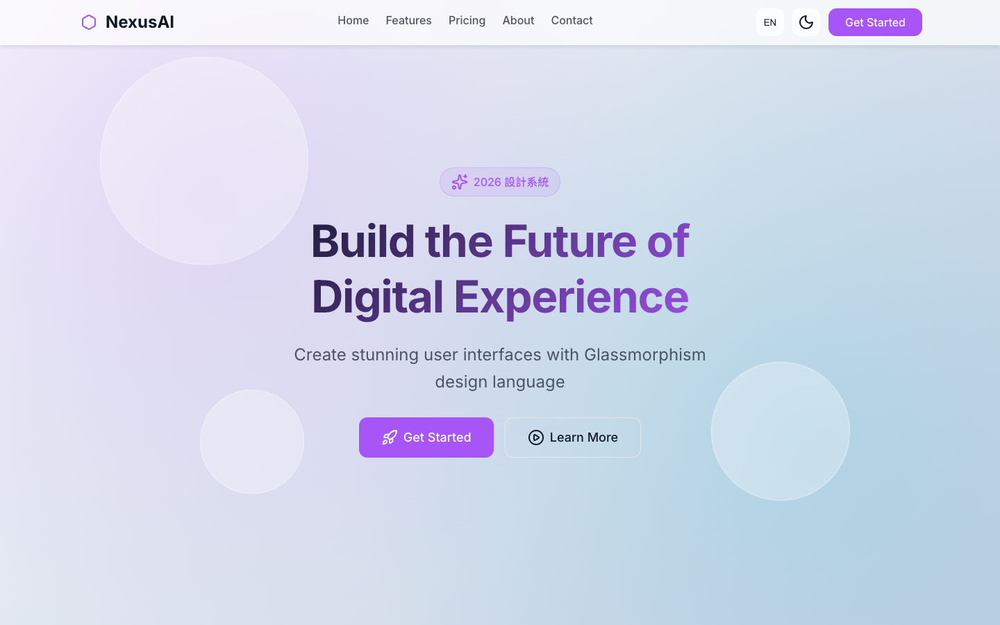
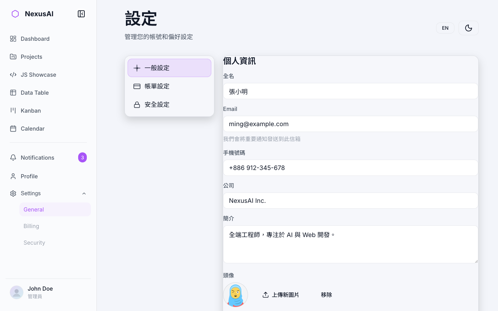

# NexusAI Glassmorphism 2026

以 **Glassmorphism（玻璃擬態）** 為核心的現代化 UI 設計系統 Demo，採用 **淺色主題優先**、支援 **深色模式** 與 **中英文切換**，並以「**共用模組**」方式組織所有頁面 UI。

- **Demo（GitHub Pages）**：`https://gamepig.github.io/NexusAI-Glassmorphism-2026/`
- **Repo**：`https://github.com/Gamepig/NexusAI-Glassmorphism-2026`

---

## 為什麼做這個專案（展示重點）

這個專案的目的不是「做一個特定產品」，而是展示一套可落地的前端設計語言與工程結構：

- **Glassmorphism 的可用性優先實作**：透明 + 模糊不只是好看，必須同時顧及對比、可讀性、背景複雜度與效能成本。
- **Design Tokens（設計令牌）驅動**：色彩、間距、圓角、陰影、玻璃參數集中管理，確保全站一致。
- **共用模組原則（最重要）**：所有可共用的 UI/功能都做成單一模組，避免多頁重複維護。
- **Mobile First 響應式 + 無障礙**：遵循 WCAG 2.1 AA 的對比與焦點可見性原則。

---

## Glassmorphism 設計重點（精華版）

- **透明（Transparency）**：透明度越高（越透），背景干擾越大；重要資訊與文字密集區要更保守。
- **背景模糊（Backdrop Blur）**：背景越複雜，blur 越要提高，避免文字落在多色背景造成對比波動。
- **邊界語言（Border/Highlight）**：細邊框 + 高光能讓玻璃「有形狀」，不會糊成一片。
- **陰影與層級（Shadow/Layering）**：用陰影定義高度（z 軸），同畫面玻璃層級建議控制在 2–3 層。
- **回退方案（Fallback）**：`backdrop-filter` 不可用或成本過高時，退回更不透明的背景色 + 保留邊框/陰影，確保層級仍清楚。

更完整的規範與驗收清單請看：`docs/Glassmorphism-設計指南.md`。

---

## 快速導覽（建議從這些頁面開始看）

> 下列連結皆指向 GitHub Pages Demo。

- **Landing Page**：`https://gamepig.github.io/NexusAI-Glassmorphism-2026/`
- **Dashboard**：`https://gamepig.github.io/NexusAI-Glassmorphism-2026/pages/dashboard.html`
- **JavaScript Showcase**：`https://gamepig.github.io/NexusAI-Glassmorphism-2026/pages/js-showcase.html`
- **Projects**：`https://gamepig.github.io/NexusAI-Glassmorphism-2026/pages/projects.html`
- **Settings（一般 / 帳務 / 安全）**
  - `https://gamepig.github.io/NexusAI-Glassmorphism-2026/pages/settings-general.html`
  - `https://gamepig.github.io/NexusAI-Glassmorphism-2026/pages/settings-billing.html`
  - `https://gamepig.github.io/NexusAI-Glassmorphism-2026/pages/settings-security.html`

完整頁面清單與功能摘要：`docs/功能清單.md`

---

## Screenshots（截圖）

> 你可以把截圖放到 `assets/images/screenshots/`，並使用下列檔名即可自動對上 README。





> 建議截圖尺寸：寬度 1600px～2400px（PNG），並盡量保留瀏覽器視窗邊界以增加展示感。

---

## 專案架構（共用模組）

原則：**所有可共用的功能，只製作一個共用模組**。

### 必須共用的模組

- **Navbar**：`js/components/navbar.js`
- **Sidebar**：`js/components/sidebar.js`
- **Footer**：`js/components/footer.js`
- **Theme**：`js/theme.js`
- **i18n**：`js/i18n.js`
- **Toast**：`js/components/toast.js`
- **Modal**：`js/components/modal.js`

### 設計系統 CSS（核心）

- `css/design-tokens.css`：設計令牌（色彩/間距/陰影/玻璃參數）
- `css/glassmorphism.css`：玻璃效果
- `css/components.css`：元件樣式
- `css/layout.css` / `css/responsive.css`：版面與響應式

---

## 本機啟動（靜態網站）

在專案根目錄啟動任一開發伺服器即可：

```bash
python3 -m http.server 8080
```

然後打開：

- `http://localhost:8080/`

---

## 外部依賴（展示用途）

本專案以原生 HTML/CSS/JavaScript 為主，展示頁可能使用以下外部庫：

- Chart.js
- Anime.js
- GSAP
- Three.js
- Lucide Icons

---

## 文件

- 設計指南（舊版）：`docs/設計指南.md`
- Glassmorphism 設計指南（可用性優先版）：`docs/Glassmorphism-設計指南.md`
- 功能清單：`docs/功能清單.md`
- 開發計劃：`docs/開發計劃.md`


